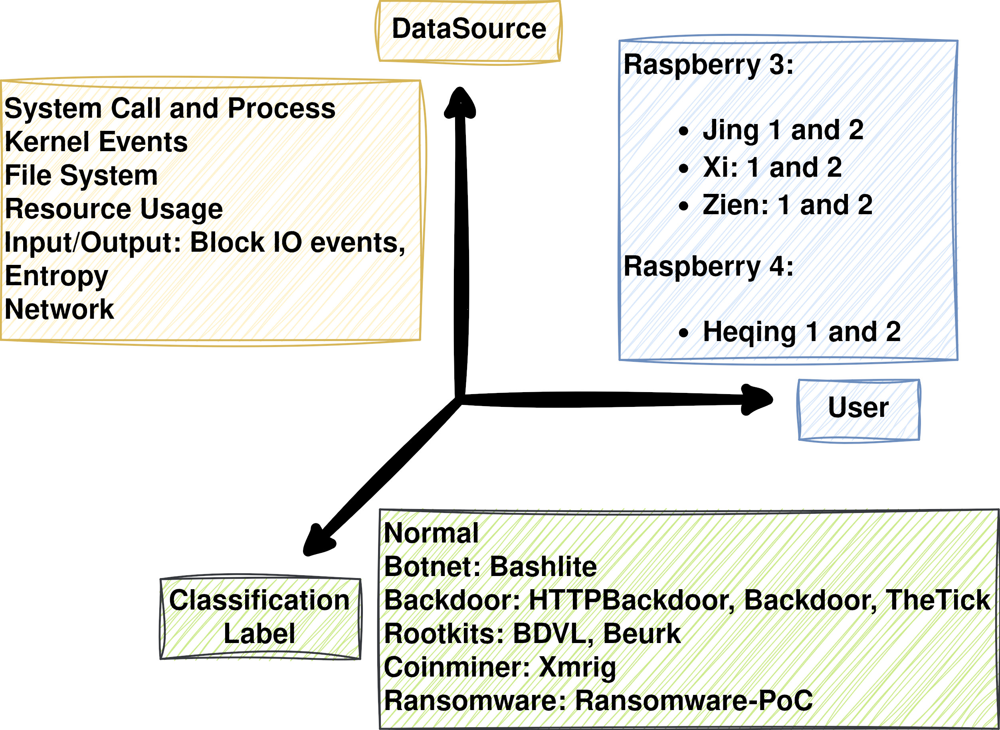

# Independent Study: Data Exploration and Feature Engineering for an IoT Device Behavior Fingerprinting Dataset
This repository contains the project files for my Independent Study **Data Exploration and Feature Engineering for an IoT Device Behavior Fingerprinting Dataset** at the research group [Communication Systems Group CSG @ Department of Informatics](https://www.csg.uzh.ch/).

I propose a method for generating Bag-of-words vectors from large text datasets without requiring all data to be loaded into memory simultaneously. Additionally, an efficient two-stage feature selection approach is presented, which combines a univariate method with a model-based method.

## Table of Contents
* [Introduction](#introduction)
* [Project Directory Structure](#project-directory-structure)
* [Details about Methodologies (also contains Reproducibility Explanations)](#details-about-methodologies)
* [References](#references)
* [Appendix](#appendix)
<!-- * [Contact](#contact) -->

## Introduction
The increasing prevalence of Internet of Things (IoT) devices has highlighted the critical need for effective malware detection mechanisms. The scarcity of publicly available datasets for IoT malware detection has constrained research progress. To address this gap, an IoT Device Behavior Fingerprinting Dataset was developed as part of a Master’s project at the University of Zurich, which captures diverse IoT device behaviors and malware attack scenarios. This study aims to enhance malware detection by refining feature engineering and selection processes applied to this dataset.

#### Dataset
The structure of the dataset is most effectively illustrated by the following diagram:



To further facilitate understanding, a brief analysis of each feature by data source is provided in the [**plots**](plots/data_exploration_box_Plots) folder, which contains data exploration box plots.
Additionally, a comprehensive list of features by data source, formatted in Python syntax, can be found in the [**classes.py**](py_dataset/classes.py) file.

#### Methodologies
We adopted a multi-step feature selection approach. Initially, constant features were removed, followed by Univariate Feature Selection to evaluate feature relevance using [sklearn's metrics](https://scikit-learn.org/stable/modules/feature_selection.html). From 260 features, we selected the top 32 using a Model-based Feature Selection method, which reduced the dataset with minimal impact on performance. Our refined feature set resulted in a negligible loss of 0.0055 in the F1 score while also maintaining effective classification performance across device families (Raspberry PI 3 and Raspberry PI 4).

Furthermore, we demonstrated that the dataset is suitable for training nodes in federated learning scenarios using [Fedstellar/Nebula](https://fedstellar.com/), which is crucial for enhancing cybersecurity in IoT environments. This study provides valuable insights into effective feature selection methods and underscores the dataset’s utility for advancing IoT malware detection.

## Project Directory Structure
The project directory is organized into the following subfolders:
````
.
├── calculating_scores: Contains Jupyter notebooks used to calculate average performance and standard deviations for each experiment using data from Fedstellar.
├── data_exploration: Contains Jupyter notebooks for exploring the dataset, including plotting the distribution of each feature across labels, as well as sample code for feature engineering.
├── data_merg: Contains Jupyter notebooks that merge data from each data source into a single dataset.
├── feature_selection: Contains Jupyter notebooks used for calculating scores of the univariate feature selection process.
├── fedstellar: sub repository containing the old source code of fedstellar
├── fedstellar_integration: Contains all code and data files needed to use the resulting dataset of this project with Fedstellar.
├── plots: I store all the boxplots for each feature of the dataset here as a picture
├── py_dataset: Contains Python code used multiple times throughout the project. The file **py_dataset/classes.py** lists all features and their corresponding data sources.
└── training: Contains all files needed to train the MLP and its variants.
````

## Details about Methodologies 
#### Feature Engineering details
The source code for feature engineering is located in the [**py_dataset**](py_dataset) folder. Among the files in the folder are three modules, each implementing a distinct feature engineering technique:

1. **Entropy Feature Engineering** ([py_dataset/entropy_feature_engineering.py](py_dataset/entropy_feature_engineering.py)): This module groups a dataframe by a specified time window and aggregates the results.
2. **NET Feature Engineering** ([py_dataset/net_feature_engineering.py](py_dataset/net_feature_engineering.py)): Similar to the entropy feature engineering module, this module groups a dataframe by a specified time window and aggregates the results.
3. **System Call Extraction** ([py_dataset/system_call_extraction.py](py_dataset/system_call_extraction.py)): This module extracts system calls from a large log collection stored in multiple zip files (unpacked folders > 50 GB). It creates CSV files through temporary unpacking and constructs a vocabulary of unique system call names. The module then vectorizes each CSV file using a CountVectorizer and applies TF-IDF transformation, which only then requires loading all data into memory simultaneously.

#### Feature Selection
The source code for calculating **univariate** feature selection scores using [scikit-learn's metrics](https://scikit-learn.org/stable/modules/feature_selection.html) is available in the [feature_selection](feature_selection) folder. To facilitate visualization, plots of the results are provided in the [plots](plots/univariant_feature_selection_plots) folder.  
A Jupyter notebook, [do_selection.ipynb](feature_selection/do_selection.ipynb), is used to store the top 200 features for each score, resulting in a total of 260 selected features. These features are listed in the [top_260_features.txt](top_260_features.txt) file.  
For **model-based** feature selection, the relevant code is located in the [training](training/single_layer) folder, where a single-layer Multilayer Perceptron (MLP) is trained and the most significant weights are selected. The resulting list are stored in the [top_32_features.txt](top_32_features.txt) file. 

#### Dataset Reproducibility
The following steps outline the data creation process:

1. **System Data Source Encoding**: Utilize the [system_call_extraction](py_dataset/system_call_extraction.py) script to generate intermediate encoded results for each device. This process yields two output files: a pickled vocabulary and a compressed NumPy data file containing the encoded Bag-of-words data.
2. **Data Merging**: Employ the Jupyter notebook [data merging jupter notebook](data_merg/30s_all) to merge the encoded data from all data sources for each device.
3. **Dataset Preparation**: Use the [create_fedstallar_dataset](training/create_fedstallar_dataset.py) script to clean and scale the merged dataset, preparing it for training.
Example usages can be found [here](create_complete_dataset.sh) as well.

#### Experiments Reproducibility
If you want to reproduce the experiments using fedstellar. Please see [here](fedstellar_integration/readme.md) for more details.

# References
* E. T. Mart´ınez Beltr´an, ´A. L. Perales G´omez, C. Feng, et al. (2024). Fedstellar: A platform for decentralized federated learning. Expert Systems with Applications, 242, 122861. doi: [10.1016/j.eswa.2023.122861](http://dx.doi.org/10.1016/j.eswa.2023.122861)
* F. Pedregosa, G. Varoquaux, A. Gramfort, et al. (2011). Scikit-learn: Machine learning in Python. Journal of Machine Learning Research, 12, 2825–2830.
* I. Guyon and A. Elisseeff (2003). An introduction to variable and feature selection. Journal of Machine Learning Research, 3(null), 1157–1182.

# Appendix
#### Disclaimer on Generative AI
I rephrased some sentences using Generative AI as well as for Coding Support.